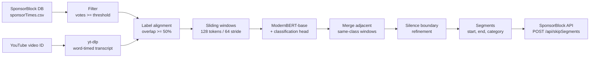

# SponsorBlock AI

> ModernBERT sponsor-segment detector for YouTube — finds sponsor, intro, outro, self-promo, interaction, and filler segments from transcript text alone, no audio needed.

[](./LICENSE)
[](https://github.com/chirag127/sponsorblock-ai/stargazers)
[](https://github.com/chirag127/sponsorblock-ai/commits)
[](https://github.com/chirag127/sponsorblock-ai/actions)


## What it is / why it exists

SponsorBlock's crowd-sourced database is powerful, but new and long-tail videos often have no submitted segments until a human watches and marks them. This project trains a **ModernBERT-base** classifier on the SponsorBlock database to predict those segments automatically — purely from the video's transcript text, so it runs on CPU without touching audio or video. Detected segments can be reviewed or submitted straight back to the SponsorBlock API.

## Links

- **Live site:** https://sponsorblock-ai.oriz.in
- **Landing page:** https://sponsorblock-ai.oriz.in
- **Model:** [`chirag127/sponsorblock-modernbert`](https://huggingface.co/chirag127/sponsorblock-modernbert) · **Demo Space:** [huggingface.co/spaces/chirag127/sponsorblock-ai](https://huggingface.co/spaces/chirag127/sponsorblock-ai)
- **Repository:** https://github.com/chirag127/sponsorblock-ai

> ⭐ If this is useful, please star the repo — it helps others find it.

## Pipeline



## Why ModernBERT instead of T5

A T5 seq2seq approach is heavyweight for what is really a labelling task. ModernBERT-base is a 2024 encoder-only model that outperforms DeBERTa/BERT on NLP benchmarks while running significantly faster on CPU — ideal for per-window classification. Sequence classification over sliding transcript windows fits the task exactly: each window gets one category label, no text generation needed.

## Features

- **Transcript-only** detection — no audio download, runs on CPU.
- **7-class** model: `sponsor`, `intro`, `outro`, `selfpromo`, `interaction`, `filler`, `none`.
- **yt-dlp** word-timed transcript ingestion, accepting both video IDs and full URLs.
- **Sliding-window** classification (128 tokens / 64 stride) with adjacent same-class merging.
- **Silence boundary refinement** to snap segment edges to natural gaps.
- **Submit back** to the SponsorBlock API (with mirror-host failover) or `--dry-run` to preview.
- **Typer CLI** with rich output tables: `fetch-db`, `predict`, `submit`, `train`, `serve`.
- **Streamlit demo** app for interactive use / HF Space deployment.
- **Colab/Kaggle training notebook** — fetch DB, build windows, fine-tune, push to Hub.

## Tech stack

- **Language:** Python 3.10+
- **ML:** transformers, torch, datasets, scikit-learn, numpy, pandas
- **Base model:** [`answerdotai/ModernBERT-base`](https://huggingface.co/answerdotai/ModernBERT-base)
- **Ingestion:** yt-dlp
- **CLI / UX:** Typer, Rich, pydantic + pydantic-settings
- **HTTP:** httpx
- **App:** Streamlit (optional `[app]` extra)
- **Training extras:** accelerate, evaluate, seqeval (`[train]`)
- **Dev:** pytest, pytest-cov, ruff, respx
- **Packaging:** hatchling
- **CI:** GitHub Actions (ci, changelog, release-notes, auto-issue-triage)

## Repo structure

```
src/sponsorblock_ai/
  constants.py          categories, label maps, window defaults, SB hosts
  cli.py                Typer CLI (fetch-db · predict · submit · train · serve)
  data/
    fetch_db.py         SponsorBlock DB download + vote filter
    transcript.py       yt-dlp word-timed transcript fetch
    windowing.py        sliding window + label assignment
    build_dataset.py    HF Dataset builder
  model/
    architecture.py     ModernBERT load (train + inference)
    trainer.py          HF Trainer wrapper + metrics
  inference/
    predict.py          video -> segments pipeline
    silence.py          boundary refinement via silence gaps
  submit/
    api.py              SponsorBlock API submission (+ mirror failover)
app/app.py              Streamlit demo / HF Space
notebooks/              train_modernbert.ipynb (Colab/Kaggle GPU)
docs/                   landing site (deployed to *.oriz.in)
tests/                  pytest unit + integration
.github/workflows/      ci · changelog · release-notes · auto-issue-triage
```

## Quick start

```bash
pip install 'sponsorblock-ai @ git+https://github.com/chirag127/sponsorblock-ai.git'

# Detect segments in a video (ID or URL)
sponsorblock-ai predict dQw4w9WgXcQ

# Detect + submit to SponsorBlock (uses SB_USER_ID)
SB_USER_ID=<your-private-id> sponsorblock-ai submit dQw4w9WgXcQ

# Preview a submission without sending it
sponsorblock-ai submit dQw4w9WgXcQ --dry-run

# Download + filter the SponsorBlock DB (cached to data/raw/)
sponsorblock-ai fetch-db --min-votes 2

# Launch the local Streamlit demo
pip install 'sponsorblock-ai[app] @ git+https://github.com/chirag127/sponsorblock-ai.git'
sponsorblock-ai serve
```

## CLI reference

| Command | What it does |
|---|---|
| `fetch-db` | Download + filter the SponsorBlock DB dump (`--dest`, `--min-votes`, `--force`). |
| `predict <video>` | Detect segments (`--model-id`, `--threshold`, `--no-refine`). |
| `submit <video>` | Detect and submit to SponsorBlock (`--user-id`/`SB_USER_ID`, `--threshold`, `--dry-run`). |
| `train` | Prints guidance — training runs on a GPU via `notebooks/train_modernbert.ipynb`. |
| `serve` | Launch the local Streamlit demo (`--port`, default 8501). |

## Configuration

Environment variables (names only — never commit real values):

| Env var | Purpose |
|---|---|
| `SB_USER_ID` | Private SponsorBlock user ID used when submitting segments |
| `HF_TOKEN` | Hugging Face token (Colab Secret) for pushing the trained model to the Hub |
| `YOUTUBE_API_KEY` | Optional YouTube Data API key |

## Training on Colab

1. Open [`notebooks/train_modernbert.ipynb`](notebooks/train_modernbert.ipynb) in [Google Colab](https://colab.research.google.com) (T4 GPU runtime).
2. Add `HF_TOKEN` to Colab Secrets.
3. Run all cells — fetches DB, builds windows, fine-tunes, evaluates, and pushes to the Hub.

## Part of the oriz family

One of ~80 sites in the [oriz](https://blog.oriz.in) family. See the blog at [blog.oriz.in](https://blog.oriz.in).

## Cost

The landing site runs **$0 on the Cloudflare free tier**. Inference runs on CPU; training uses free Colab/Kaggle GPU.

## Contributing

Issues and PRs welcome. Run `ruff` and `pytest` before opening a PR.

## Status

Work in progress — pipeline and CLI are functional; the published model and eval metrics are being finalized. Conventional commits are the changelog.

## License

[MIT](./LICENSE) © Chirag Singhal

## Author

Chirag Singhal — chirag@oriz.in
